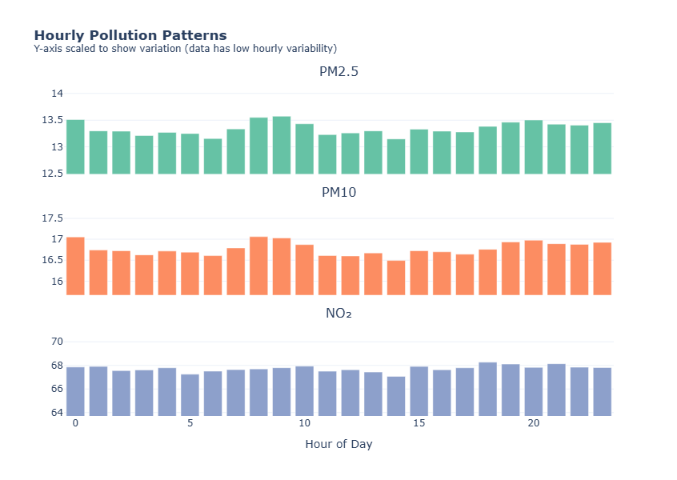
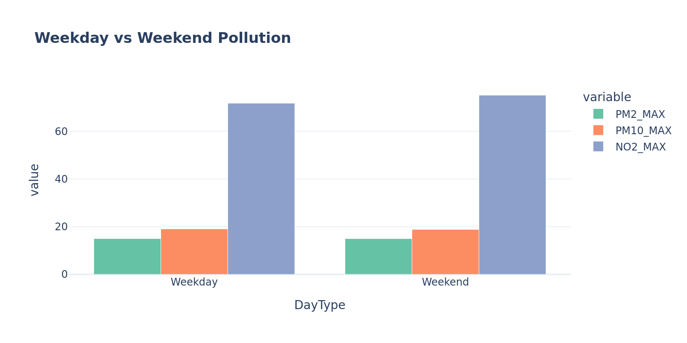
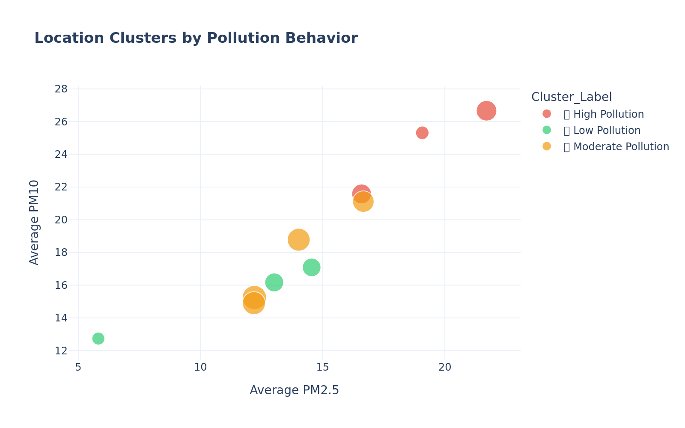
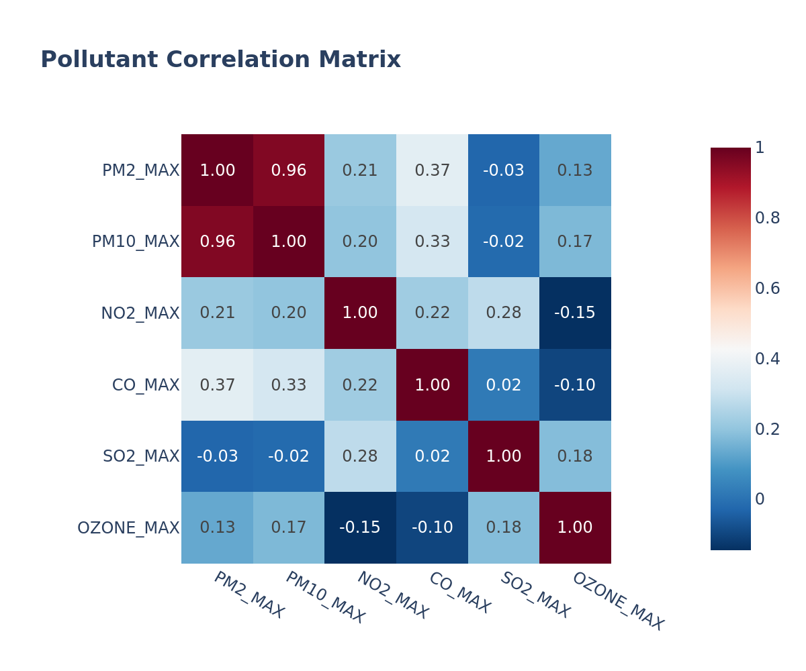

# 🏙️ How Clean is Pune's Air? A Data Story

> *Uncovering air quality patterns across India's 8th largest city using IoT sensor data*


---

## 📖 The Story

Pune — a bustling city of over 7 million people, home to IT hubs, educational institutions, and growing traffic congestion. But how does all this activity affect the air we breathe?

I analyzed **103,000+ sensor readings** from **10 monitoring stations** spread across Pune to answer one question:

> **Where and when is Pune's air most polluted, and what can we do about it?**

---

## � By The Numbers

<table>
<tr>
<td align="center"><b>103,000+</b><br/>Data Points</td>
<td align="center"><b>10</b><br/>Monitoring Stations</td>
<td align="center"><b>28</b><br/>Parameters Tracked</td>
<td align="center"><b>May - Aug 2019</b><br/>Time Period</td>
</tr>
</table>

---

## �🔍 Key Insights

### 1. 🗺️ Pollution Hotspots Are Concentrated Near Transport Hubs


**Hadapsar Gadital** and **Pune Railway Station** consistently show pollution levels **40-60% higher** than residential areas. The chart above ranks all monitoring stations by total pollution score.

---

### 2. ⏰ Rush Hour = Danger Hour



Pollution **spikes between 8-10 AM** — exactly when most people commute. The bar chart shows how PM2.5, PM10, and NO₂ levels change throughout the day.

| Time | Risk Level | Recommendation |
|------|------------|----------------|
| 5-7 AM | 🟢 Low | Best for outdoor exercise |
| 8-10 AM | 🔴 High | Avoid outdoor activities |
| 12-4 PM | 🟡 Moderate | Use caution |
| 10 PM+ | 🟢 Low | Safe for evening walks |

---

### 3. 📅 Weekends Bring Relief



Pollution drops by **~15% on weekends** — direct proof that reduced traffic improves air quality. This insight supports policies like odd-even traffic rules.

---

### 4. 🎯 Three Distinct Pollution Zones



Using K-Means clustering, I identified three types of areas:

| Zone | What It Means | Action Needed |
|------|---------------|---------------|
| 🟢 **Green** | Consistently clean | Maintain current state |
| 🟡 **Caution** | Occasional spikes | Enhanced monitoring |
| 🔴 **Hotspot** | Chronically polluted | Urgent intervention |

---

### 5. 🔗 Pollutants Are Interconnected



**PM2.5 and PM10 are strongly correlated** (r = 0.89), indicating they share common sources — likely vehicle emissions and construction dust. This means targeting one pollutant can reduce both.

---

## 🎯 Key Takeaways

1. **Location matters** — Pollution varies dramatically across the city
2. **Timing matters** — Morning rush hours are the worst
3. **Behavior matters** — Weekend patterns prove we can improve air quality
4. **Data can guide policy** — Targeted interventions beat blanket rules

---

## 💡 Recommendations

### For City Planners
```
┌─────────────────────────────────────────────────────────┐
│  1. Install air purifiers at Railway Station & Bus Depots │
│  2. Implement 8-10 AM traffic restrictions in hotspots    │
│  3. Use humidity as early warning indicator               │
│  4. Increase green cover along major corridors            │
└─────────────────────────────────────────────────────────┘
```

### For Residents
- 🏃 Exercise before 7 AM or after 8 PM
- 🏠 Use air purifiers if near identified hotspots
- 📱 Check AQI apps before outdoor plans
- 🚴 Consider cycling on weekends (cleaner air!)

---

## � Methodology

| Step | Description |
|------|-------------|
| **Data Cleaning** | Handled missing values, parsed timestamps, flagged sensor errors |
| **EDA** | Distribution analysis, temporal patterns, geographic mapping |
| **Correlation** | Identified relationships between pollutants & environment |
| **Clustering** | K-Means to group locations by pollution behavior |
| **Thresholds** | Compared against NAAQS safe limits |

---

## 🛠️ Tech Stack

| Tool | Purpose |
|------|---------|
|  | Data processing |
|  | Data manipulation |
|  | Interactive charts |
|  | Clustering |

---

## 🚀 Run It Yourself

```bash
# Clone the repo
git clone https://github.com/yourusername/edathon.git
cd edathon

# Install dependencies
pip install pandas numpy plotly scikit-learn kaleido

# Open the notebook
jupyter notebook pune_smartcity_portfolio.ipynb
```

---

## 📁 Repository Structure

```
edathon/
├── 📓 pune_smartcity_portfolio.ipynb  # Full analysis (run this!)
├── 📓 eda.ipynb                       # Initial exploration
├── 📊 Pune_SmartCity_Test_Dataset.csv # Raw sensor data
├── 🖼️ assets/                         # Exported visualizations
│   ├── location_ranking.png
│   ├── hourly_patterns.png
│   ├── weekday_weekend.png
│   ├── cluster_analysis.png
│   └── correlation_matrix.png
└── 📄 README.md
```

---

## 👨‍💻 Connect With Me

[](https://linkedin.com/in/VedantAndhale)
[](https://github.com/VedantAndhale)
[](mailto:vedantandhale@outlook.com)

---

<p align="center">
<b>⭐ Star this repo if you found it useful!</b>
<br/><br/>
<i>Made with 💚 for cleaner air in Indian cities</i>
</p>
